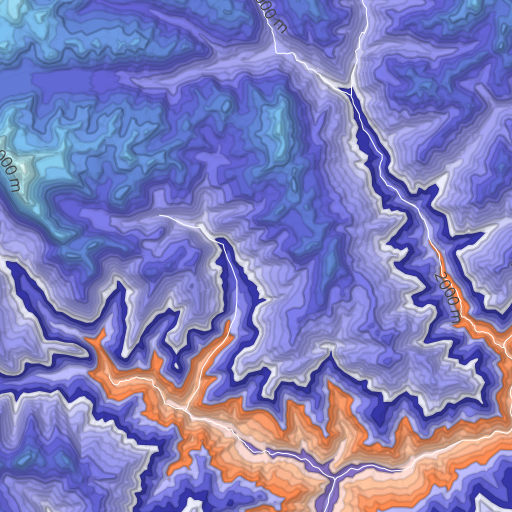

# Hypsometric

A study of color ramps for terrain-based hypsometric gradients.  Get psychadelic.

### Map Data Layers

Imhof uses the following MapBox Studio source layers:

* mapbox.mapbox-streets-v5 *Map data © OpenStreetMap contributors*
* mapbox.mapbox-terrain-v2
